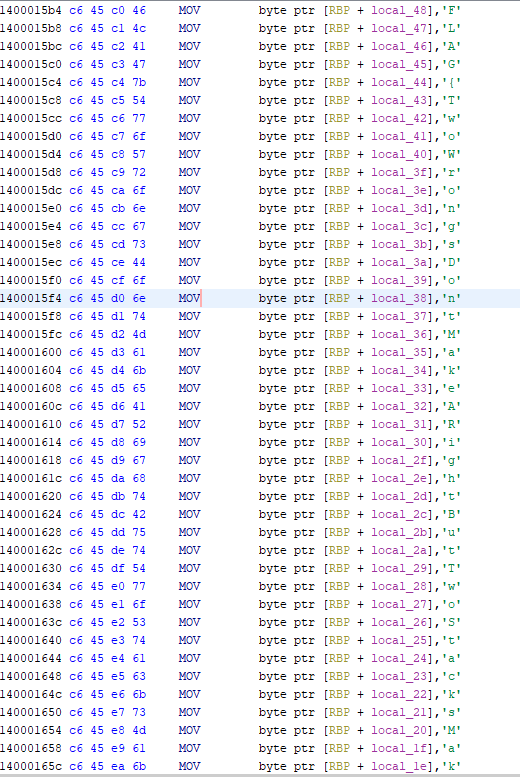
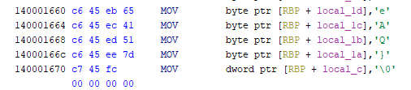

1. Open with Ghidra
2. Search strings
3. Locate "Cracked" in strings, go to this function
4. Enter the function into the decompiler through the XREF
5. Rename function to cracked; now find references to this function
6. Locate the unconditional call; we are now in the main function
7. We can see a function in the if statement; this is the failure function (checks for argc)
8. We can see another function below the if statement (which checks argc)
9. Inside this function, we can see a list of hex values. Double click 
    to find the value in the dissassembler. Now, we can convert each value to ascii to get our result

