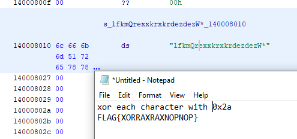

1. Open PE with Ghidra
2. Symbol tree -> exports -> entry
3. Enter the unamed function in entry
4. Scroll down and find the first unnamed function call before exit() / cexit()
5. Enter this function. This is (probably) the main function.
6. We can see a string inside the for loop. Go to the memory location of the string.
7. After xoring each character with 0x2a (as is being done in the loop), we get our flag

