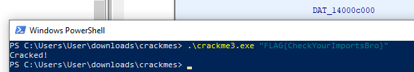

1. Open PE with Ghidra
2. Go to Symbol Tree and find __main
3. Find first unconditional call, open it in decompiler
4. Find last function being called before exit, this is main
5. We can see CheckYourImports(); we must create a dll in order to run the flag
6. (the c file and dll file are included in this repo)
7. We can investigate the function being called before the for loop with the failure function
    It looks like it hashes parameter 2 and compares to the memory address at DAT_****
8. This means the hash to our input is located here.
9. FLAG{CheckYourImportsBro} hashes to this value
10. Now we can run the flag (which is Flag{CheckYourImportsBro}, the function name)

