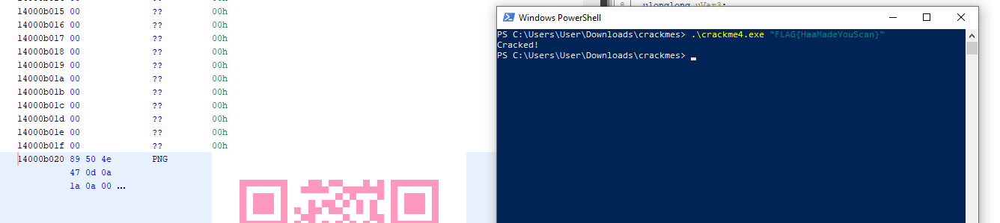

1. Open PE in Ghidra 
2. Search strings of at least length three
3. Scroll down until PNG <PNG-Image> shows up in the Code Unit column
4. Move to this location in the dissassembler; there we can see a QR code
5. Scan the QR code to get the flag FLAG{HaaMadeYouScan}

