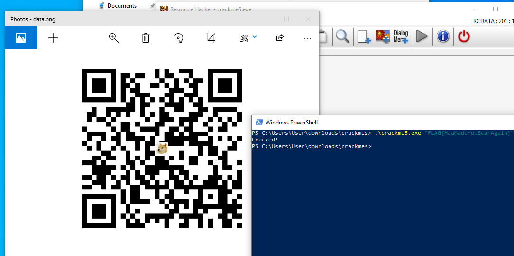

1. Open PE in resource hacker
2. Navigate to RCDATA folder
3. Click on 201 : 1033
    We can see that it is a 820 x 820 PNG in the bottom bar.
4. Save the PNG to desktop as a .png file
    We can now see that it is an image file.
