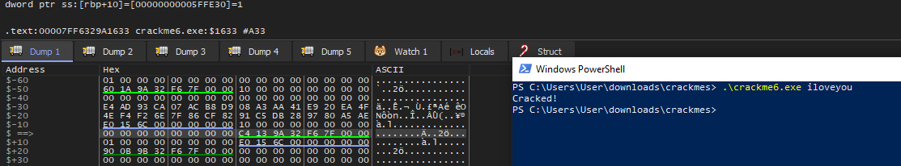

1. Open with Ghidra
2. Symbol Tree -> Exports -> Entry
3. Enter the unnamed function in entry
4. Enter the last unnamed function before exit() or _cexit() are called
    a. This is main
    b. We can see that we appear to be comparing the hash of argv[1] with an address
    c. Let's see what that address is!
5. Open with x64dbg
    a. Press run until we get to the Entrypoint annotation
    b. Right click -> Search for -> Current region -> command -> input "sub RSP, 0x70"
        I. I chose this command because I am trying to find the main function in x64dbg
            and this command is in the function definition in the dissassembler and seems
            somewhat unique.
    c. Set a breakpoint after the two mov commands following the rax,D9B9.... and rdx,4FEA commands
    d. We can see that RBP contains 5FFE20 and the mov commands are moving a qword ptr
        into [5FFE20 - 30]
    e. Right click the value in RBP -> follow in dump
    f. Double click the address bar in the dump at the location we went to
    g. Scroll up to where it says $-30... this is where our hash is!
    h. Step into the program until the cmp command can be seen to populate the second half of the hash
6. Google this hash. We can see that the result is iloveyou, which must be the flag!

