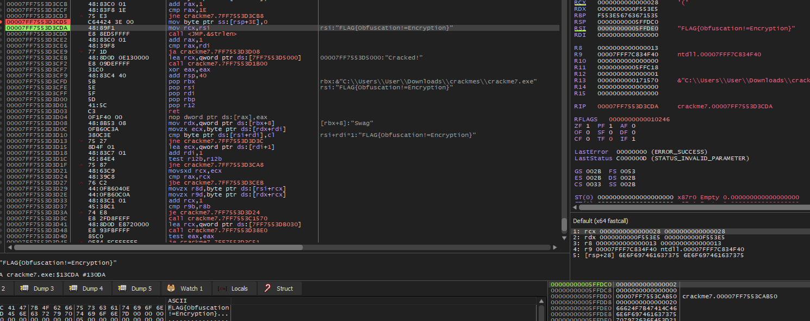

1. Open with ghidra
2. Symbol tree -> Exports -> Entry
3. Enter the last unnamed function before exit() or __cexit() are called
    - This is main
4. We can see the "Cracked" function defined outside, with a goto call after an if statement
    - We must figure out what this if statement is doing to get to this function
5. It looks like the variables being compared are being operated with above.
    - Let's run this in a x64dbg so we can see what they're potentially being set to before the comparison
6. Open with x64dbg
7. File -> Change Command Line and put a space and  add any string at the end
8. Click run until breakpoint to entrypoint is hit
9. We can see strlen being called right before the comparison statement
10. We can see in the do-while loop above the comparison, there is an command to CMP RAX,0x1e
    - Search for this command and set a breakpoint at it
    - The next call is a JNZ, so this is the looping part of the program; set a breakpoint to the instruction after this one to exit the loop
    - If we step into one more call, we can see RSI now contains our flag
    - Go to the registers, right click RSI value -> follow in dump to see the flag

